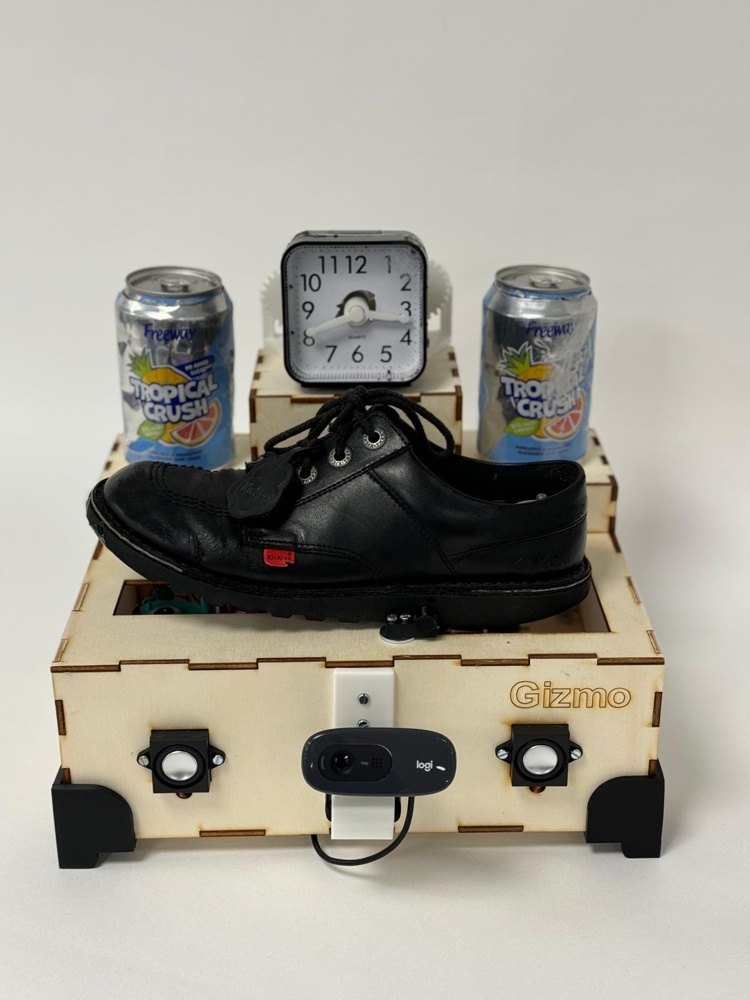
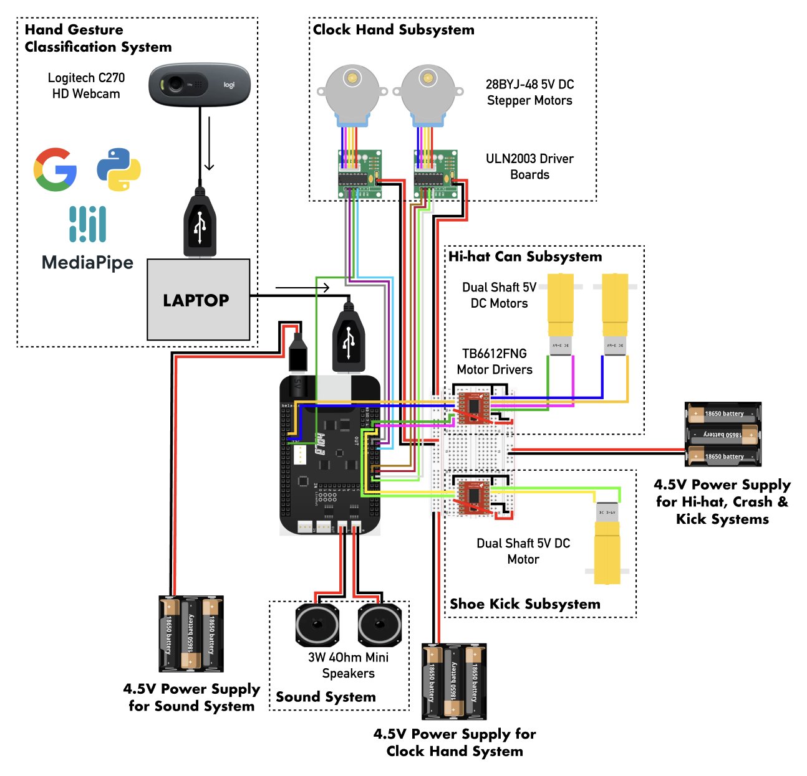

# Bela Project: TrashKIT



In this project, the capabilities of the open-source embedded computing platform, Bela were utilised to create an interactive drum kit using an assortment of upcycled materials. The product employs OpenCV and Google's HandGestureClasssifier to analyse users' hand movements and translate them into real-time actions that trigger various actions equipped with sound capabilities.

## Content

Portfolio for further project detail can be found in [TrashKIT_Portfolio.pdf](TrashKIT_Portfolio.pdf) file.

Bela code for project can be found in [Bela](Bela) folder.

Python scripts for OpenCV and OSC can be found in [python_scripts](python_scripts) folder.

- [Prerequisites](https://github.com/hillaryfraley/TrashKIT#prerequisites)
  - [Hardware Components](https://github.com/hillaryfraley/TrashKIT#hardware-components)
  - [Software Components](https://github.com/hillaryfraley/TrashKIT#software-components)
  - [Installing](https://github.com/hillaryfraley/TrashKIT#installing)
- [Deployment](https://github.com/hillaryfraley/TrashKIT#deployment)
  - [Steps](https://github.com/hillaryfraley/TrashKIT#steps)
- [Running OSC test](https://github.com/hillaryfraley/TrashKIT#running-osc-test)
  - [Break down into OSC test](https://github.com/hillaryfraley/TrashKIT#break-down-into-osc-test)
- [Built With](https://github.com/hillaryfraley/TrashKIT#built-with)
- [Authors](https://github.com/hillaryfraley/TrashKIT#authors)
- [License](https://github.com/hillaryfraley/TrashKIT#license)
- [Acknowledgements](https://github.com/hillaryfraley/TrashKIT#acknowledgments)

## Prerequisites

These instructions will describe the process of building the project from the ground up. See deployment for notes on how to deploy the project code on a live system.

### Hardware Components:

- Bela board
- Old Small Clock
- Old Shoe
- Empty Cans (x2)
- 28BYJ-48 5V DC Stepper Motors (x2)
- Dual Shaft 5V DC Motors (x2)
- ULN2003 Driver Boards (x2)
- TB6612FNG Motor Drivers (x2)
- 3W 4Ohm Mini Speakers (x2)
- 4.5V Battery Holders (x3)
- 1.5v Batteries (x9)
- Small Breadboard
- Logitech C270 Webcam
- Wires

### Electronic Circuit:



### Software Components:

- Bela IDE
- VSCode IDE
- Google's HandGestureClassifier model

### Installing

Download or clone the Github Repo

```
git clone https://github.com/YOUR-USERNAME/TrashKIT
```

Create a virtual environment

```
python3 -m venv venv
```

Activate the virtual environment

```
source venv/bin/activate
```

Open python_scripts folder and install the necessary libraries

```
pip install -r requirements.txt
```

Run main.py to activate the CV & Python-OSC logic for the project

```
python3 main.py
```

**NOTE**: Update the Bela IP address in the consumer.py file to the IP address of your own Bela board

## Deployment

Process of building the embedded user-interaction system within TrashKIT and Bela.

### Steps

1. Plug in the Bela to your laptop and open the Bela IDE
2. Drag the GizmoV1.zip file in the Bela folder into the Bela IDE to download the project onto your Bela
3. Wire the electronics for the embedded system

**NOTE**: Make sure to update the I/O pin numbers for the DC motors and stepper motors for your own Bela (if necessary).

## Running OSC test

Test to ensure that OSC client communication has been established between the Bela board and computer

### Break down into OSC test

Open python_scripts folder and run osc_test.py to test OSC implementation

```
python3 osc_test.py
```

## Built With

- [Bela/ C++](https://learn.bela.io) - The embedded computing platform used for the electronics and interactive system
- [Python](https://www.python.org) - Programming language used for computer vision aspects of project

## Authors

- **Andrew Ize-Iyamu** - _Coding_
- **Vasco de Noronha** - _Mechanisms_

## License

This project is licensed under the MIT License - see the [LICENSE](LICENSE) file for details

## Acknowledgements

- Andrew McPherson for guidance on using and developing embedded systems with the Bela board
- Andy Brand for guidance on building and experimenting with mechanical systems
